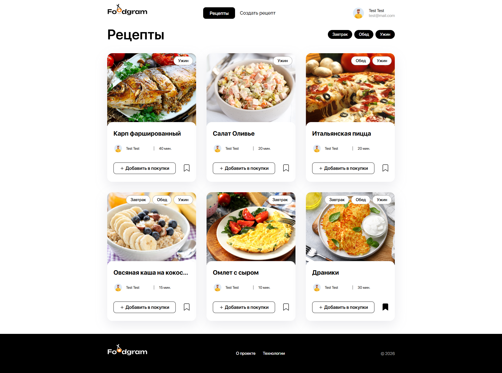

# Foodgram

**Foodgram** - REST API на Django REST Framework для платформы любителей кулинарии.  



Основные возможности:
- Регистрация и авторизация через JWT
- Смена пароля и аватара
- Профили пользователей
- Подписки на пользователей
- Создание, редактирование и удаление рецептов
- Теги рецептов
- Избранное
- Экспорт «Списка покупок»
- Административная панель Django для управления пользователями и контентом

Проект состоит из четырех Docker-контейнеров:
- gateway - прокси-сервер;
- frontend - SPA-приложение на Node.js (React);
- backend - API-сервер на Django REST Framework;
- db - база данных.

## Оглавление

- [Технологии](#технологии)
- [Роли пользователей](#роли-пользователей)
- [Установка и запуск](#установка-и-запуск)
- [Документация](#документация)
- [Авторы](#авторы)


## Технологии
- Python 3.12
- Django 5.2.5
- Django REST Framework 3.16.1
- PostgreSQL 17
- django-filter
- Djoser
- Simple JWT
- python-dotenv
- gunicorn
- Docker
- Nginx


## Роли пользователей

**Гость** - анонимный пользователь, который может просматривать рецепты, но не имеет возможности добавлять их в избранное или публиковать свои.

**Пользователь** - авторизованный пользователь, который может публиковать рецепты, сохранять понравившиеся рецепты в избранное, подписываться на других пользователей и экспортировать «Список покупок».

**Администратор** - пользователь с полными правами, который может управлять всеми рецептами, тегами и пользователями.

## Установка и запуск
### Локальная разработка
```
git clone https://github.com/aksianchuk/foodgram.git
cd foodgram
cp .env.example .env # создайте и укажите настройки
docker-compose up -d
docker compose exec backend python manage.py migrate
docker compose exec backend python manage.py collectstatic
docker compose exec backend cp -r /app/collected_static/. /backend_static/static/
docker compose exec backend python manage.py load_ingredients --path data/ingredients.json
docker-compose exec backend python manage.py createsuperuser
```
Проект будет доступен по адресу:  
http://localhost:8000

### Продакшн
```
git clone https://github.com/aksianchuk/foodgram.git
cd foodgram
cp .env.example .env # создайте и укажите настройки
sudo docker-compose -f docker-compose.production.yml up -d
sudo docker compose -f docker-compose.production.yml exec backend python manage.py migrate
sudo docker compose -f docker-compose.production.yml exec backend python manage.py collectstatic
sudo docker compose -f docker-compose.production.yml exec backend cp -r /app/collected_static/. /backend_static/static/
sudo docker compose -f docker-compose.production.yml exec backend python manage.py load_ingredients --path data/ingredients.json
sudo docker compose -f docker-compose.production.yml exec backend python manage.py createsuperuser
```
Проект будет доступен по адресу вашего сервера.  

**Примечание:** рекомендуется использовать nginx как обратный прокси перед Gunicorn.

## Документация
Документация доступна после запуска проекта по адресу:   
http://localhost:8000/api/docs/
## Авторы
**Бэкенд:**  
https://github.com/aksianchuk (Никита Оксенчук)  
**Фронтенд:**  
https://practicum.yandex.com (команда Яндекс Практикум)